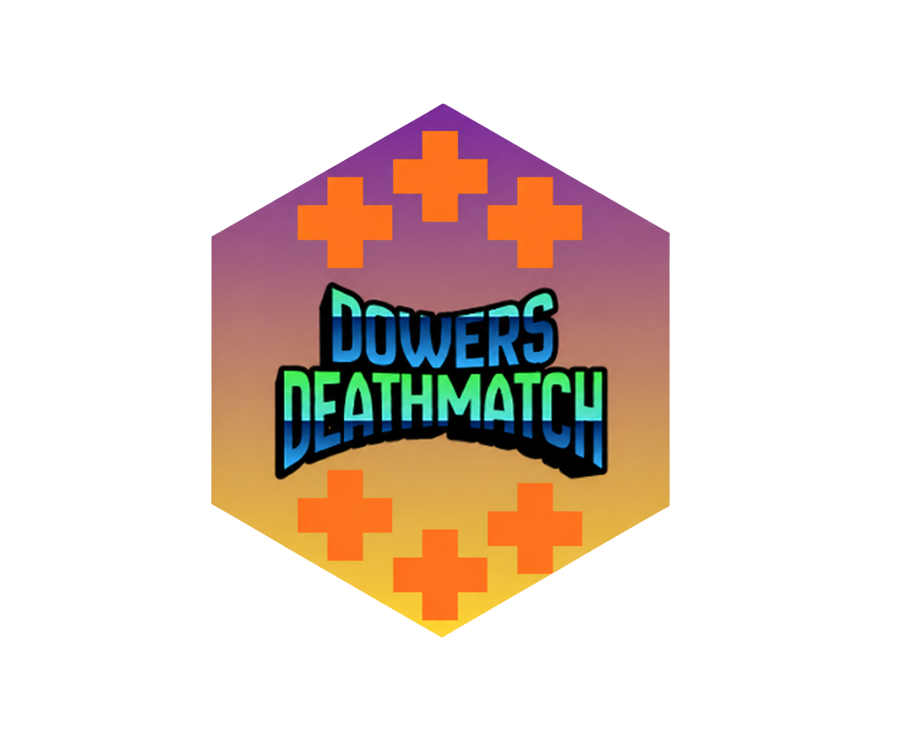

# Dowers Deathmatch

Welcome to our project, this project is a game that was made in godot and is aiming to be a Deathmatch like game from 2010s and earlier.
# What is the game about?
The game is about playing old-style deathmatch. My inspiration was and still is old-style games like Quake, Doom and so on..
- You can expect some basic guns with two special ones.
- 7 basic and 2 special guns
# Is this project still in progress?
- Yes it is. And if you notice some not detailed things, then please try to ignore it, because its still WIP. Thank you.
# Who helped you develop this game?
- ITZ_dudefkos = Designer
- Dominik_Gaming11 ( Me ) = Programmer
# How long does it take you to make an update?
That depends, but were trying to make our game good. Hopefully one day it will come true.
# How does Multiplayer work?
Well local works on a code that is given to you, you can share this to your discord friends etc..
Public works little differently, because it generates the same thing as a local one, but with an port so you can share this to your friends that are far away and use a different wifi.
# Special notes
- Thank you yall who tested our game, we will make a credit for yall later in the game!!
- Wish us luck with developement and most importantly, have fun!
